# 람다 아키텍처 실습

> `NoSQL`에 해당하는 엔진들은 `Update`에 취약(`Delete & Insert`)하기 때문에 태생적으로 `Lambda 아키텍처` 구조와 적합한 구조라고 말할 수 있습니다. 물론, 일반적인 동적인 서빙레이어(`MySQL, MongoDB`)를 사용하는것도 가능하지만, 일괄 색인 시에 엔진에 부하가 있을 수 있으므로 주의가 필요합니다

## 1. 최신버전 업데이트

> 원격 터미널에 접속하여 관련 코드를 최신 버전으로 내려받고, 과거에 실행된 컨테이너가 없는지 확인하고 종료합니다

### 1.1 최신 소스를 내려 받습니다

> 자주 사용하는 명령어는 `alias` 를 걸어둡니다  

```bash
# terminal
cd ~/work/ssm-seoul-data-engineer
git pull

# alias
alias d="docker-compose"
```

### 1.2 이전에 기동된 컨테이너가 있다면 강제 종료합니다

```bash
# terminal 
docker rm -f `docker ps -aq`
`docker ps -a` 명령으로 결과가 없다면 모든 컨테이너가 종료되었다고 보시면 됩니다
```

### 1.3 실습을 위한 이미지를 내려받고 컨테이너를 기동합니다

> 본 실습에서는 사용법을 익히기 위해 개별 컨테이너를 기동하는 방식으로 진행하지만, 모든 컨테이너를 다 올려도 됩니다

```bash
# 개별 컨테이너 기동 : docker-compose.yml 파일의 서비스 이름을 명시
docker-compose up -d <service-name>

# 전체 컨테이너 기동 : 서비스 이름을 명시하지 않으면 모든 컨테이너 기동
cd ~/work/ssm-seoul-data-engineer/lambda
docker-compose pull
docker-compose up -d

# 기동된 컨테이너 확인
docker-compose ps
```


## 2. 스피드 레이어를 통한 데이터 및 지표 적재

> 람다 아키텍처를 통한 비즈니스 로직은 동일하지만 집계를 통한 스트리밍 지표 적재

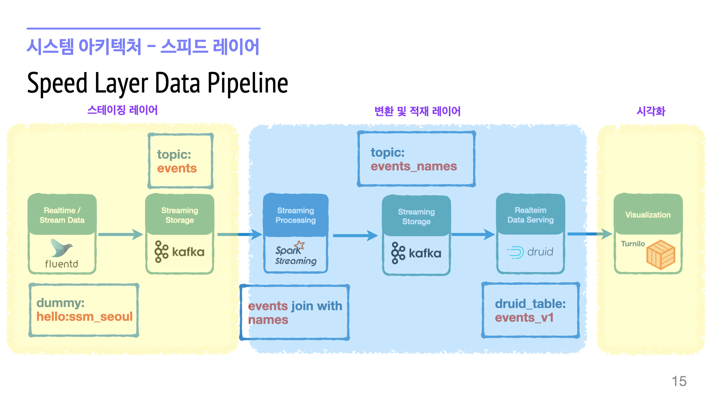

### 2.1 `fluentd` 통한 더미 데이터 카프카로 저장

>  `Keynote: 데이터 레이크 2일차 5교시 - 플루언트디 코어` 문서를 통해 기본 동작 방식과 구문에 대해 이해가 되셨다면, 플루언트디 컨테이너 기동 `docker-compose up -d fluentd` 하여 실습을 진행합니다
#### 1. `fluentd` 컨테이너 기동 및 접속

```bash
# terminal
docker-compose up -d fluentd
docker-compose exec fluentd bash
```

> 편의상 개별 컨테이너를 하나씩 기동하면서 실습하는 예제로 작성 되었습니다

#### 2. 더미 로그 생성용 설정 파일 생성

```xml
# cat > /fluentd/config/lambda-v1.conf
<source>
  @type dummy
  tag debug
  auto_increment_key id
  dummy {"hello":"ssm-seoul"}
</source>

<match debug>
  @type stdout
</match>
```

> `tag` 값은 테스트 시에만 `debug` 로 지정하고 추후 실제 데이터 생성 시에는 `info` 로 변경해야 하는 점에 주의합니다

```bash
# docker: fluentd
fluentd -c /fluentd/config/lambda-v1.conf
```

> `fluentd` 기동 및 출력 확인

#### 3. `filter` 지시자를 이용하여 시간 필드를 추가

```xml
# cat > /fluentd/config/lambda-v2.conf
<source>
  @type dummy
  tag debug
  auto_increment_key id
  dummy {"hello":"ssm-seoul"}
</source>

<filter debug>
    @type record_transformer
    enable_ruby
    <record>
        time ${Time.at(time).strftime('%Y-%m-%d %H:%M:%S')}
    </record>
</filter>

<match debug>
  @type stdout
</match>
```

```bash
# docker: fluentd
fluentd -c /fluentd/config/lambda-v2.conf
```

> `filter` 지시자를 통해 `time` 필드를 추가하여 현재 시간으로 출력 되는지 확인합니다

#### 4.  `match` 지시자를 이용하여 `kafka` 싱크 설정

```xml
# cat > /fluentd/config/lambda-v3.conf
# https://docs.fluentd.org/v/0.12/input/dummy
<source>
  @type dummy
  tag info
  auto_increment_key id
  dummy {"hello":"ssm-seoul"}
</source>

# https://docs.fluentd.org/v/0.12/filter/record_transformer
<filter info>
    @type record_transformer
    enable_ruby
    <record>
        time ${Time.at(time).strftime('%Y-%m-%d %H:%M:%S')}
    </record>
</filter>

# https://docs.fluentd.org/v/0.12/output/stdout
<match debug>
  @type stdout
</match>

# https://docs.fluentd.org/v/0.12/output/kafka
<match info>
  @type kafka_buffered

  # list of seed brokers
  brokers kafka:9093

  # buffer settings
  buffer_type file
  buffer_path /var/log/td-agent/buffer/tmp
  flush_interval 3s

  # topic settings
  default_topic events

  # data type settings
  output_data_type json
  compression_codec gzip

  # producer settings
  max_send_retries 1
  required_acks -1
</match>
```

> 위와 같이 설정 파일을 생성하고, 카프카 기동을 위해 새로운 터미널을 하나 더 열어 접속합니다

#### 5. 카프카 컨테이너 기동 및 메시지 전송

> 카프카로 메시지를 전송하기 전에 카프카 컨테이너를 기동합니다

```bash
# terminal
docker-compose up -d kafka
```

> 다시 `fluentd` 터미널에서 카프카로 메시지 전송을 수행합니다

```bash
# docker: fluentd
fluentd -c /fluentd/config/lambda-v3.conf
```

#### 6. 카프카 토픽 메시지 확인

> 이번에는 `kafka` 컨테이너에 접속하여 카프카 메시지를 직접 확인합니다

```bash
# terminal
docker-compose exec kafka bash
```

> 컨테이너 내부에서 토픽을 확인하고, `events` 토픽의 메시지를 확인합니다

```bash
# docker: kafka
cd /opt/kafka

# 토픽 목록 출력
boot="--bootstrap-server localhost:9093"
bin/kafka-topics.sh $boot --list

# 토픽 메시지 확인
# 옵션 : --from-beginning --max-messages <num>
bin/kafka-console-consumer.sh $boot --topic events
```

> 첫 번째 단계인 `fluentd` 에이전트를 통해 메시지를 `kafka` 클러스터의 `events` 토픽으로 전송이 완료 되었습니다


### 2.2  `events` 토픽을 읽어서 `events_names` 토픽에 저장

>    `Keynote: 데이터 레이크 2일차 6교시 - 아파치 스파크 스트리밍` 문서를 통해 기본적인 스트리밍 애플리케이션 동작 방식을 이해 하셨다면, `notebook` 컨테이너를 기동하여 실습을 진행합니다.

#### 1. `notebook` 컨테이너 기동 및 접속

```bash
# terminal
docker-compose up -d notebook
docker-compose logs notebook | grep 127
# [JupyterLab] http://127.0.0.1:8888/labtoken=d0ffa88b4ca509687f7a6502e4376f1bbf198462f83c2
```

> 위와 같이 `127.0.0.1` 로 시작하는 전체 주소를 복사하여 크롬 브라우저로 접속합니다. **반드시 labtoken 값을 포함하여** 접속해야 정상적인 접속을 할 수 있습니다.

#### 2. `spark session` 생성 및 `events` 토픽 출력하기

> 스파크 애플리케이션 기동을 위해 스파크 세션을 초기화 합니다. 모든 노트북 명령은 해당 셀을 선택한 상태에서 `Shift+Enter` 명령으로 해당 셀 실행이 가능합니다

```python
from pyspark.sql import *
from pyspark.sql.functions import *
from pyspark.sql.types import *
from IPython.display import display, display_pretty, clear_output, JSON

spark = (
    SparkSession
    .builder
    .config("spark.sql.session.timeZone", "Asia/Seoul")
    .getOrCreate()
)

# 노트북에서 테이블 형태로 데이터 프레임 출력을 위한 설정을 합니다
spark.conf.set("spark.sql.repl.eagerEval.enabled", True) # display enabled
spark.conf.set("spark.sql.repl.eagerEval.truncate", 100) # display output columns size

# 공통 데이터 위치
home_jovyan = "/home/jovyan"
work_data = f"{home_jovyan}/work/data"
work_dir=!pwd
work_dir = work_dir[0]

# 로컬 환경 최적화
spark.conf.set("spark.sql.shuffle.partitions", 5) # the number of partitions to use when shuffling data for joins or aggregations.
spark.conf.set("spark.sql.streaming.forceDeleteTempCheckpointLocation", "true")

# 현재 기동된 스파크 애플리케이션의 포트를 확인하기 위해 스파크 정보를 출력합니다
spark
```

>  노트북에서 스파크 스트리밍 상태 및 데이터 조회를 위한 함수 선언

```python
# 스트림 테이블을 주기적으로 조회하는 함수 (name: 이름, sql: Spark SQL, iterations: 반복횟수, sleep_secs: 인터벌)
def displayStream(name, sql, iterations, sleep_secs):
    from time import sleep
    i = 1
    for x in range(iterations):
        clear_output(wait=True)              # 출력 Cell 을 지웁니다
        display('[' + name + '] Iteration: '+str(i)+', Query: '+sql)
        display(spark.sql(sql))              # Spark SQL 을 수행합니다
        sleep(sleep_secs)                    # sleep_secs 초 만큼 대기합니다
        i += 1

# 스트림 쿼리의 상태를 주기적으로 조회하는 함수 (name: 이름, query: Streaming Query, iterations: 반복횟수, sleep_secs: 인터벌)
def displayStatus(name, query, iterations, sleep_secs):
    from time import sleep
    i = 1
    for x in range(iterations):
        clear_output(wait=True)      # Output Cell 의 내용을 지웁니다
        display('[' + name + '] Iteration: '+str(i)+', Status: '+query.status['message'])
        display(query.lastProgress)  # 마지막 수행된 쿼리의 상태를 출력합니다
        sleep(sleep_secs)            # 지정된 시간(초)을 대기합니다
        i += 1
```

> 카프카 토픽 `events` 으로부터 스트림 데이터를 읽어서 노트북에 출력하는 코드를 작성하되, 카프카의 시작 오프셋의 위치는 `latest` 옵션으로 지정하고, 카프카 서버  `kafka:9093` 의 `events` 토픽으로 부터 메시지를 읽어와서 데이터 변환을 수행합니다.

```python
# "kafka:9093" 카프카 서버의 events토픽을 가장 최근위치(latest)에서 읽어오는 리더를 작성합니다
kafkaReader = (
    spark
  .readStream
  .format("kafka")
  .option("kafka.bootstrap.servers", "카프카_주소:카프카_포트")
  .option("subscribe", "카프카_토픽")
  .option("startingOffsets", "카프카_오프셋_위치")
  .load()
)
kafkaReader.printSchema()

# 로그 스키마 : {"hello":"ssm-seoul","id":0,"time":"2022-09-30 16:42:01"}
kafkaSchema = (
    StructType()
    .add(StructField("id", LongType()))
    .add(StructField("hello", StringType()))
    .add(StructField("time", StringType()))
)

# JSON 문서를 읽어오기 위해서 from_json 함수를 사용합니다
# events.id 값은 무한대로 증가하는 숫자이므로 names 테이블의 0~9값과 조인하기 위해 나머지 연산자(%)를 사용합니다
kafkaSelector = (
    kafkaReader
    .select(
        col("key").cast("string"),
        from_json(col("value").cast("string"), kafkaSchema).alias("events")
    )
    .selectExpr("events.id % 10 as mod_id", "events.*")
)
kafkaSelector.printSchema()
```

> 여기까지는 토픽 정보를 읽어와서 변환하는 과정을 구현했고, 이제는 화면으로 출력하여 디버깅을 해 봅니다.

```python
# 콘솔로 출력하기 위해서 memory 기반의 테이블로 생성합니다
queryName = "consoleSink"
kafkaWriter = (
    kafkaSelector.select("*")
    .writeStream
    .queryName(queryName)
    .format("memory")
    .outputMode("append")
)

# 언제까지 수행했는지 정보를 저장하기 위한 체크포인트 위치를 지정합니다
checkpointLocation = f"{work_dir}/tmp/{queryName}"
!rm -rf $checkpointLocation

# 얼마나 자주 스트리밍 작업을 수행할 지 인터벌을 지정합니다
kafkaTrigger = (
    kafkaWriter
    .trigger(processingTime="5 second")
    .option("checkpointLocation", checkpointLocation)
)

# 파이썬의 경우 콘솔 디버깅이 노트북 표준출력으로 나오기 때문에, 위에서 선언한 함수로 조회합니다
kafkaQuery = kafkaTrigger.start()
displayStream(queryName, f"select * from {queryName} order by mod_id desc", 10, 6)
kafkaQuery.stop()
```

> 약 1분 정도 결과를 확인하면 자동으로 종료 됩니다.

#### 3.  `names` 테이블과 `outer_join` 하여 콘솔에 출력

> `/home/jovyan/work/data/names` 경로에 저장되어 있는 `names` 테이블을 읽어서 `events_names` 라는 토픽에 저장합니다. 해당 토픽은 스파크가 자동으로 생성해 주기 때문에 별도로 생성할 필요는 없습니다

```python
# 대상 경로에 저장된 파일을 읽어서 스파크 데이터 프레임으로 생성합니다
namePath = "/home/jovyan/work/data/names"
nameStatic = (
    spark
    .read
    .option("inferSchema", "true")
    .json(namePath)
)

# 스키마와 데이터를 확인합니다
nameStatic.printSchema()
nameStatic.show(truncate=False)
```

> `events` 테이블과 `names` 테이블 조인을 위한 조건을 생성합니다

```python
# 앞서서 id 값의 나머지를 통해서 0~9 사이 값으로 생성된 mod_id 컬럼과 names 테이블의 uid 컬럼으로 조인
joinExpression = (kafkaSelector.mod_id == nameStatic.uid)
staticSelector = kafkaSelector.join(nameStatic, joinExpression, "leftOuter")
```

> 조인 조건을 이용하여 위의 콘솔 예제와 마찬가지로 메모리 테이블에 저장하여 조회합니다

```python
# 디버깅을 위해 메모리 테이블에 저장하고, 다시 카프카로 전송을 위해 JSON 포맷으로 변환합니다
queryName = "memorySink"
staticWriter = (
    staticSelector
    .selectExpr("time", "id as user_id", "name as user_name", "hello", "uid")
    .selectExpr("user_id as key", "to_json(struct(*)) as value")
    .writeStream
    .queryName(queryName)
    .format("memory")
    .outputMode("append")
)

# 언제까지 수행했는지 정보를 저장하기 위한 체크포인트 위치를 지정합니다
checkpointLocation = f"{work_dir}/tmp/{queryName}"
!rm -rf $checkpointLocation

# 얼마나 자주 스트리밍 작업을 수행할 지 인터벌을 지정합니다
staticTrigger = (
    staticWriter
    .trigger(processingTime="5 second")
    .option("checkpointLocation", checkpointLocation)
)
```

> 메모리 테이블을 조회하여 결과를 확인합니다

```python
# 트리거를 시작하는 순간 스파크 스트리밍 애플리케이션이 기동되고, 동적 쿼리를 수행할 수 있습니다
staticQuery = staticTrigger.start()
displayStream(queryName, f"select * from {queryName} order by key desc", 10, 6)
staticQuery.explain(True)
staticQuery.stop()
```

> 생성된 쿼리를 이용하여 6초 인터벌로 총 10회 조회합니다

#### 4. 검증 완료된 데이터를 `events_names` 토픽에 저장

> `stream` 데이터를 집계하지 않고 원본 메시지에서 추가 필드만 `enrich` 하고 `kafka` 싱크로 `events_names` 토픽을 지정하여 적재합니다. 카프카 브로커 주소는 `kafka:9093` 이며 출력 토픽은 `events_names` 으로 지정합니다

```python
# 카프카 브로커 주소는 'kafka:9093' 이며 출력 토픽은 'events_names' 입니다
queryName = "kafkaSink"
staticWriter = (
    staticSelector
    .selectExpr("time", "id as user_id", "name as user_name", "hello", "uid")
    .selectExpr("cast(user_id as string) as key", "to_json(struct(*)) as value")
    .writeStream
    .queryName(queryName)
    .format("kafka")
    .option("kafka.bootstrap.servers", "카프카_주소:카프카_포트")
    .option("topic", "출력_카프카_토픽")
    .outputMode("append")
)

checkpointLocation = f"{work_dir}/tmp/{queryName}"
!rm -rf $checkpointLocation

staticTrigger = (
    staticWriter
    .trigger(processingTime="5 second")
    .option("checkpointLocation", checkpointLocation)
)

staticQuery = staticTrigger.start()
displayStatus(queryName, staticQuery, 600, 10)
staticQuery.stop()
```

#### 5. 생성된 토픽 메시지를 직접 확인

> 앞서 테스트 한대로 `kafka` 컨테이너로 접속하여 정상적으로 메시지가 저장되는 지 확인합니다

```bash
# terminal
docker-compose exec kafka bash
```

```bash
# docker: kafka
cd /opt/kafka

# 토픽 목록 출력
boot="--bootstrap-server localhost:9093"
bin/kafka-topics.sh $boot --list

# 토픽 메시지 확인
# 옵션 : --from-beginning --max-messages <num>
bin/kafka-console-consumer.sh $boot --topic events_names
```


### 2.3 `events_names` 토픽을 `druid` 테이블로 적재합니다

>   `druid-kafka-index` 를 통해 드루이드에는 카프카 토픽에 저장된 데이터를 드루이드 테이블로 색인할 수 있는 엔진을 제공합니다. http://localhost:8088 으로 접속하여 관리자 도구를 통해 적재할 수 있습니다.  

#### 1. 드루이드 카프카 적재기를 통해 드루이드 테이블 색인을 수행합니다

> 캡쳐된 화면을 통해서 순서대로 진행하면 됩니다.  

* 대시보드에서는 수행할 수 있는 모든 작업을 확인할 수 있습니다
  
* 첫 번째 메뉴`Load data`를 선택하고, `Start a new spec`을 클릭하여 외부 데이터를 입수합니다
  
* `Apache Kafka` 를 선택합니다.
  
* 접속 가능한 카프카 클러스터의 브로커 `kafka:9093` 및 토픽 `events_names`를 입력하고 Preview 를 선택합니다
  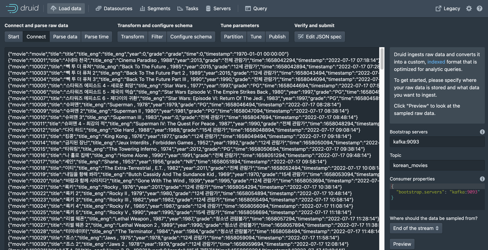
  - 여기서 카프카 오프셋 처음(earliest) 혹은 최근(latest)부터를 선택할 수 있습니다
* 입력 데이터의 포맷(json, csv, tsv 등)을 선택합니다
  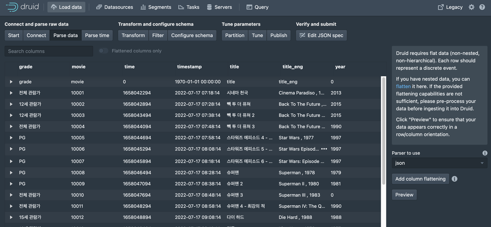
* 시간 컬럼을 선택해야 하는데, 표준포맷(yyyy-MM-dd HH:mm:dd)인 `timestamp` 컬럼을 선택합니다
  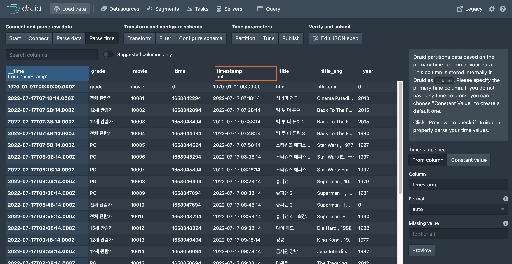
  - 시간 컬럼이 없다면 상수값을 넣거나, 선택하여 파싱하는 방법도 있습니다만, 애초에 정상적인 시간을 생성해서 받아오는 것이 좋습니다
* 제공하는 함수 등을 이용하여 컬럼을 추가할 수 있습니다
  
  - [druid expression](https://druid.apache.org/docs//0.15.1-incubating/misc/math-expr.html) 페이지를 참고합니다
* 제공하는 필터 함수를 이용하여 원하는 데이터만 필터링 할 수 있습니다
  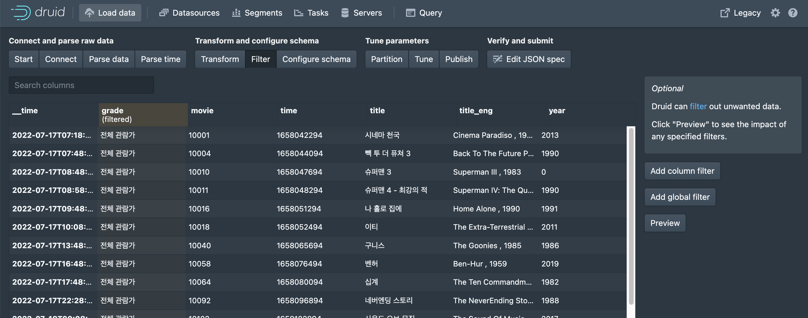
  - [druid filters](https://druid.apache.org/docs//0.15.1-incubating/querying/filters.html) 페이지를 참고합니다
* 최종 스키마를 결정할 수 있으며, 자동으로 생성되는 숫자 컬럼은 제거합니다
  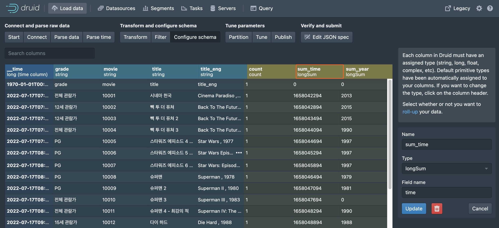
* 테이블의 파티션 구성을 설계할 수 있습니다
  
  - [Segment](https://druid.apache.org/docs/latest/design/segments.html) 설정은 데이터의 특성에 따라 조정이 필요함
  - Segment granularity : 엔진 특성상 Roll-Up을 통해서 성능을 끌어올려야 하므로, 중복가능한 지표의 특성
  - Max rows per segment : 세그먼트 당 최대 레코드 수
  - Max total rows : 최대 레코드 수
* 성능 및 튜닝을 위한 설정
  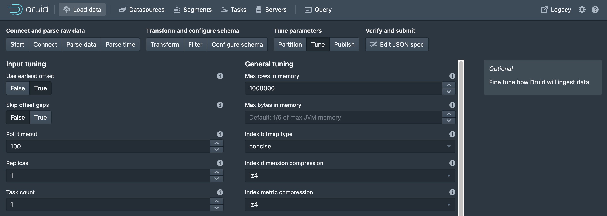
  - earliest offset : 처음부터 읽어오고 싶은 경우는 True 로 선택
* 테이블 이름 및 최종 배포 설정
  
  - append to existing 
  - log parse exceptions
* 최종 생성된 요청 내역을 확인
  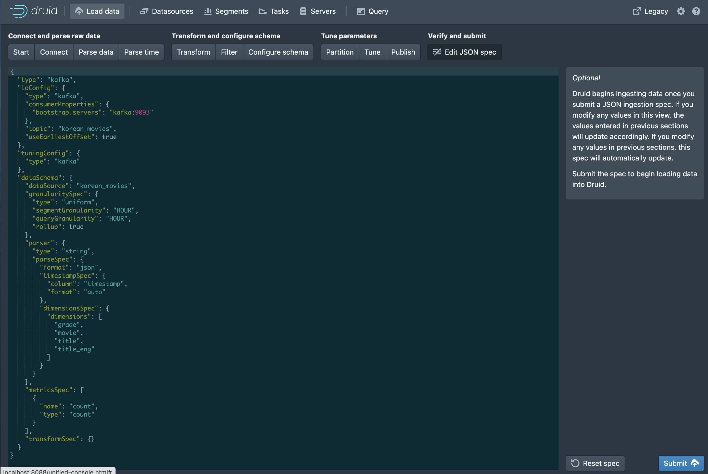
  - 여기서 내용을 수정하면 앞에서 UI 수정을 다시 해야 하므로, 내용을 잘 이해하는 부분이 아니라면 수정하지 않는 것을 추천합니다
* 최종 결과를 제출하면 타스크 탭으로 이동하여 확인이 가능합니다
  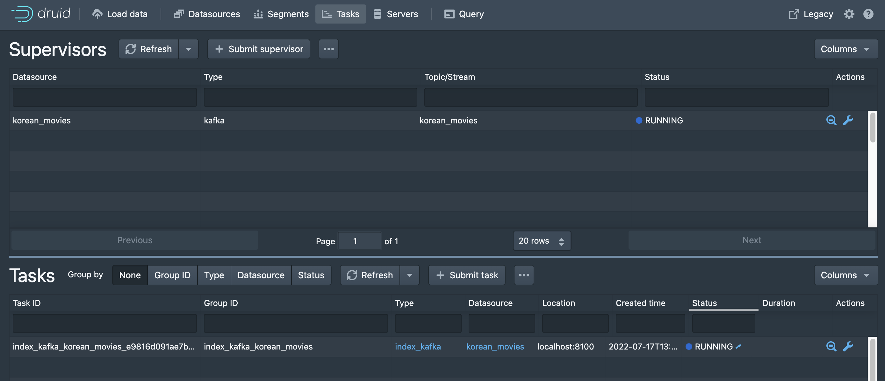
  - 모든 색인 및 백그라운드 작업은 `Tasks` 탭에서 수행됩니다
* 정상적으로 작업이 적재되었다면 조회가 가능합니다
  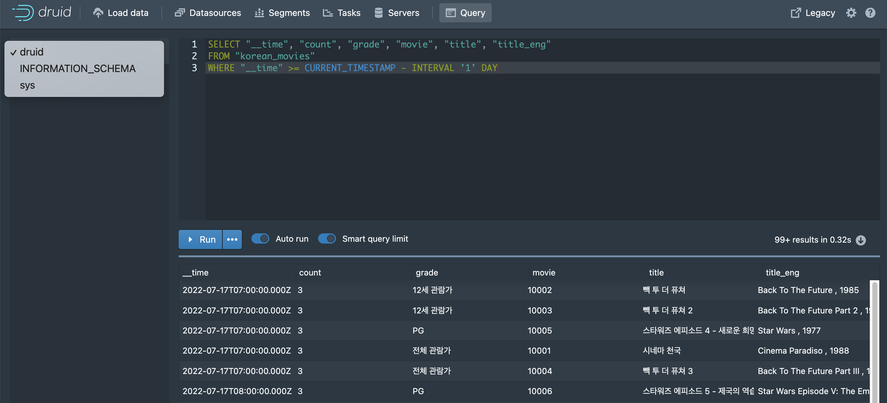
  - 대상 테이블을 선택하고 실시간 테이블 조회가 가능합니다


### 2.4 드루이드 테이블을 터닐로를 통해 시각화 합니다

#### 1. 터닐로 명령어를 통해서 드루이드 테이블 설정을 생성합니다

> 아래의 명령을 통해서 설정 파일을 생성하고, 수정하여 다시 덮어쓸 수도 있습니다

```bash
docker-compose run turnilo turnilo --druid http://druid:8082 --print-config > turnilo/config/new-confing.yml
```

#### 2. 터닐로가 드루이드 테이블을 인식하게 하기 위해 컨테이너를 재시작합니다

```bash
docker-compose restart turnilo
```

#### 3. 웹 페이지를 통해 실시간 지표 조회 및 탐색을 수행합니다

> http://localhost:9091 사이트에 접속합니다

* 접속하면 `events_names` 페이지를 확인할 수 있습니다
  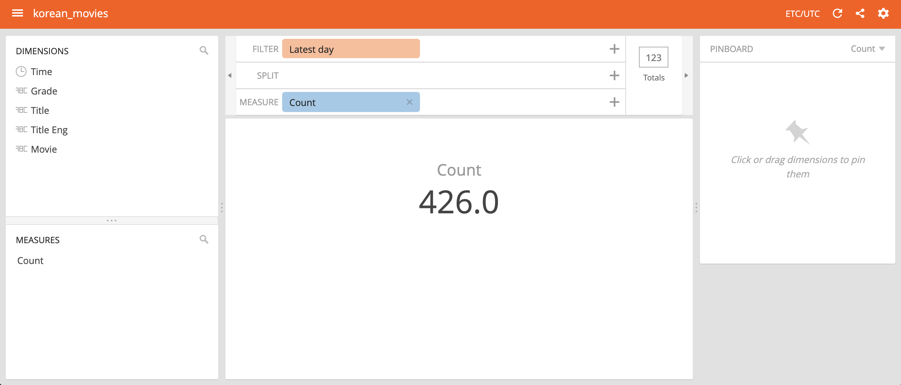

* 기본적으로 드래그앤드랍 방식으로 탐험이 가능합니다 
  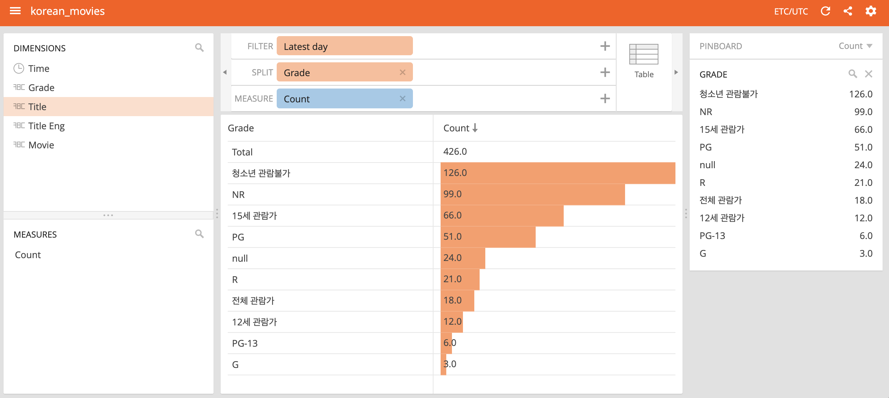

* 우측의 차트종류에 따라 집계 축이 달라지는 경우가 있으므로 주의합니다
  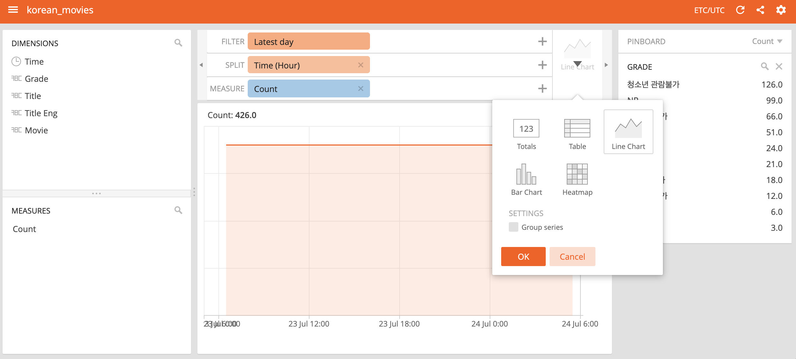

* 디멘젼의 경우 핀해 두고, 자주 사용하는 필터로 사용할 수 있습니다
  

* 데이터입력 시간을 UTC기준으로 적재하고, 타임존에 따라 조회할 수 있습니다
  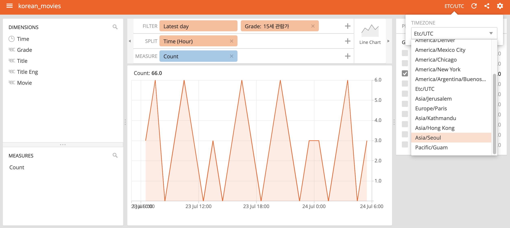

* 인터벌을 지정하고 주기적으로 리프래시하여 대시보드와 같이 사용할 수 있습니다
  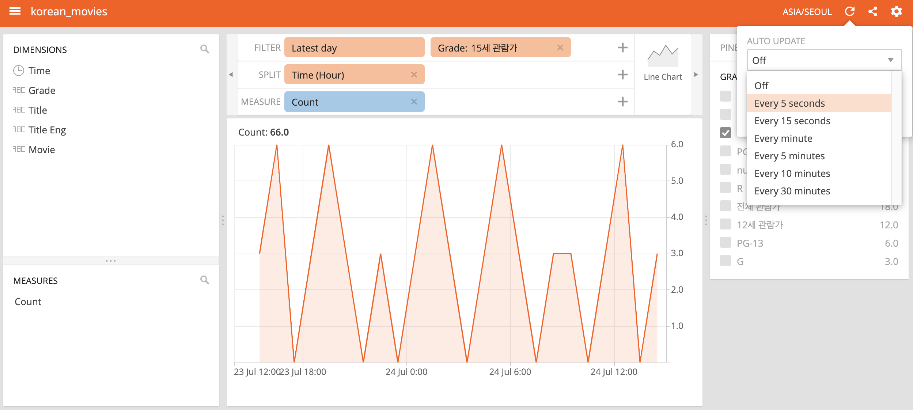


## 3. 배치 레이어를 통한 변환 적재 실습

> 모든 실시간 작업은 종료되었다고 가정하고, 익일이 되어서 이전 일자의 데이터를 일괄 처리하는 예제입니다 명확하게 색인 데이터를 삭제하고 전체 색인을 일괄 수행하는 예제를 통해서 배치 레이어 작업을 테스트합니다. 실시간으로 적재된 데이터를 배치 레이어를 통해 전체 데이터를 중복제거, 지연로그를 포함하여 일괄 처리  

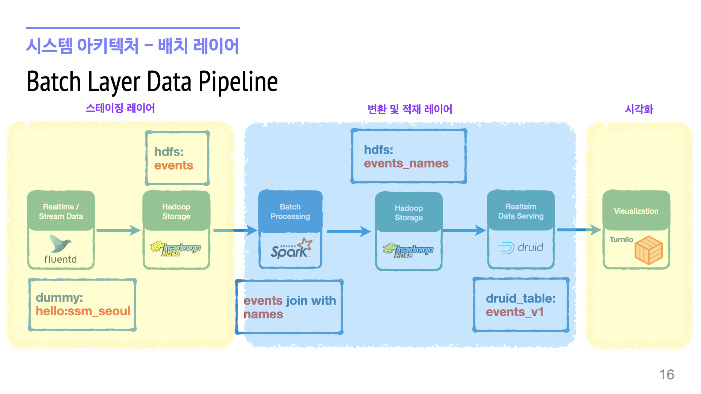

### 3.1 `fluentd` 통한 예제 데이터 저장

>  로컬 환경상 `hadoop` 에 저장하는 대신 로컬 `bound volume` 에 저장하고 해당 볼륨을 개별 노트북 컨테이너에서 `mount` 하여 사용하는 방식으로 실습을 진행합니다

```bash
# terminal
docker-compose up -d fluentd
docker-compose exec fluentd bash
```

> 아래와 같이 `/fluentd/config/lambda-v4.conf` 파일을 생성하여 로그를 별도 파일로 저장합니다

```xml
# cat > /fluentd/config/lambda-v4.conf
# https://docs.fluentd.org/v/0.12/input/dummy
<source>
  @type dummy
  tag info
  auto_increment_key id
  dummy {"hello":"ssm-seoul"}
</source>

# https://docs.fluentd.org/v/0.12/filter/record_transformer
<filter info>
    @type record_transformer
    enable_ruby
    <record>
        time ${Time.at(time).strftime('%Y-%m-%d %H:%M:%S')}
    </record>
</filter>

# https://docs.fluentd.org/v/0.12/output/stdout
<match debug>
  @type stdout
</match>

# https://docs.fluentd.org/v/0.12/buffer/file
<match info>
    @type file
    @log_level info
    add_path_suffix true
    path_suffix .json
    path /fluentd/target/lambda/batch/names.%Y%m%d.%H
    <format>
        @type json
    </format>
    <buffer time>
        timekey 1h
        timekey_use_utc false
        timekey_wait 10s
        timekey_zone +0900
        flush_mode immediate
        flush_thread_count 8
    </buffer>
</match>
```

```bash
# docker: fluentd
fluentd -c /fluentd/config/lambda-v4.conf
```

> 기동 이후에 /fluentd/target/lambda/batch 경로에 파일이 생성되는 지 확인합니다


### 3.2 `events`  데이터를 `names` 테이블과 조인하여 저장합니다

>  `Keynote: 데이터 레이크 3일차 4교시 - 아파치 스파크 배치` 문서를 통해 기본 동작 방식과 구문에 대해 이해가 되셨다면, `/fluentd/target/lambda/batch` 경로에 저장된 `events` 데이터와 `/home/jovyan/work/data/names` 경로에 저장된 `names` 테이블을 조인하여 `/home/jovyan/work/tmp/output` 경로에 `json` 포맷으로 저장합니다.

#### 1. 스파크 세션을 생성하고 데이터 소스를 읽어옵니다

> 스파크 애플리케이션 기동을 위한 스파크 세션을 생성합니다

```python
# 코어 스파크 라이브러리를 임포트 합니다
from pyspark.sql import *
from pyspark.sql.functions import *
from pyspark.sql.types import *
from IPython.display import display, display_pretty, clear_output, JSON

spark = (
    SparkSession
    .builder
    .appName("Data Engineer Training Course")
    .config("spark.sql.session.timeZone", "Asia/Seoul")
    .getOrCreate()
)

# 노트북에서 테이블 형태로 데이터 프레임 출력을 위한 설정을 합니다
from IPython.display import display, display_pretty, clear_output, JSON
spark.conf.set("spark.sql.repl.eagerEval.enabled", True) # display enabled
spark.conf.set("spark.sql.repl.eagerEval.truncate", 100) # display output columns size

# 공통 데이터 위치
home_jovyan = "/home/jovyan"
work_data = f"{home_jovyan}/work/data"
work_dir=!pwd
work_dir = work_dir[0]

# 로컬 환경 최적화
spark.conf.set("spark.sql.shuffle.partitions", 5) # the number of partitions to use when shuffling data for joins or aggregations.
spark.conf.set("spark.sql.streaming.forceDeleteTempCheckpointLocation", "true")
spark
```

```python
# events 로그를 streamLogs 라는 데이터프레임으로 읽어와서 스키마와 데이터를 출력합니다
eventsPath = "/fluentd/target/lambda/batch"
streamLogs = (
    spark
    .read
    .option("inferSchema", "true")
    .json(eventsPath)
).withColumn("mod_id", expr("id % 10"))
streamLogs.printSchema()
streamLogs.show(truncate=False)

# names 테이블을 nameStatic 이라는 데이터프레임으로 읽어와서 스티마와 데이터를 출력합니다
namePath = "/home/jovyan/work/data/names"
nameStatic = (
    spark
    .read
    .option("inferSchema", "true")
    .json(namePath)
)
nameStatic.printSchema()
nameStatic.show(truncate=False)
```

```python
# 조인을 위한 조건과 조인 후에 스키마 및 데이터를 출력합니다
expression = streamLogs.mod_id == nameStatic.uid
staticJoin = streamLogs.join(nameStatic, expression, "leftOuter")
staticJoin.printSchema()
staticJoin.show(10, truncate=False)

# 최종 출력 스키마를 일치시키기 위해서 변환작업을 수행하고, 스키마와 데이터를 확인합니다
staticResult = (
    staticJoin
    .withColumnRenamed("id", "user_id")
    .withColumnRenamed("name", "user_name")
    .drop("mod_id")
)
staticResult.printSchema()
staticResult.show(truncate=False)

# 최종 결과를 tmp/output 경로에 저장합니다
targetPath = "/home/jovyan/work/tmp/output"
staticResult.write.mode("overwrite").json(targetPath)
```

>  생성되는 데이터를 그대로 사용하는 경우 완전히 일치하는 결과를 얻을 수는 없지만, 원본 소스가 동일하다면 완전히 일치하는 결과가 나와야만 합니다


### 3.3 `kafka-hadoop-index` 통하여 `druid` 에 적재합니다

>  적재된 데이터를 `Local Disk` 작업을 통해서 `/notebooks/output` 경로를 지정하여, 일괄 색인을 수행하고 `events_batch` 테이블에 적재합니다


## 4. 아키텍처 개선 및 확장 검토

### 4.1 `fluentd` 통하여 멀티 싱크를 통하여 파이프라인 간소화

> `fluentd` 의 `copy` 및 `label` 지시자를 사용하여 하나의 데이터소스를 여러개의 싱크로 지정할 수 있습니다

```xml
# cat > /fluentd/config/lambda-v5.conf
<source>
  @type dummy
  tag info
  auto_increment_key id
  dummy {"hello":"ssm-seoul"}
</source>

# https://docs.fluentd.org/v/0.12/filter/record_transformer
<filter info>
    @type record_transformer
    enable_ruby
    <record>
        time ${Time.at(time).strftime('%Y-%m-%d %H:%M:%S')}
    </record>
</filter>

# https://docs.fluentd.org/output/copy
# https://docs.fluentd.org/output/relabel
<match test>
  @type copy
  <store>
    @type relabel
    @label @KAFKA
  </store>
  <store>
    @type relabel
    @label @HDFS
  </store>
</match>

# https://docs.fluentd.org/v/0.12/output/stdout
<match debug>
  @type stdout
</match>

# https://docs.fluentd.org/v/0.12/output/kafka
<label @KAFKA>
  <match info>
    @type kafka_buffered

    # list of seed brokers
    brokers kafka:9093

    # buffer settings
    buffer_type file
    buffer_path /var/log/td-agent/buffer/tmp
    flush_interval 3s

    # topic settings
    default_topic events

    # data type settings
    output_data_type json
    compression_codec gzip

    # producer settings
    max_send_retries 1
    required_acks -1
  </match>
</label>

# https://docs.fluentd.org/v/0.12/buffer/file
<label @HDFS>
  <match info>
      @type file
      @log_level info
      add_path_suffix true
      path_suffix .json
      path /fluentd/target/lambda/batch/names.%Y%m%d.%H
      <format>
          @type json
      </format>
      <buffer time>
          timekey 1h
          timekey_use_utc false
          timekey_wait 10s
          timekey_zone +0900
          flush_mode immediate
          flush_thread_count 8
      </buffer>
  </match>
</label>
```

```bash
# docker: fluentd
fluentd -c /fluentd/config/lambda-v5.conf
```

> 기존의 파이프라인을 하나로 통합하여 운영할 수 있습니다

### 4.2 스케줄링 서비스를 통해 의존성 및 스케줄링 통합

>  `Airflow`  혹은 `Crontab` 등의 스케줄러를 통해 `Spark` 작업을 주기적으로 수행하게 하여 주기적으로 배치 작업을 통해서 실시간 지표를 갱신하도록 하는 것이 일반적인 구성입니다


## 5. 모든 컨테이너 종료

> 기동된 모든 컨테이너가 정상 종료되어야 다음 실습이 원활하게 수행됩니다.

```bash
# terminal
cd ~/work/ssm-seoul-data-engineer/lambda
docker-compose down

# docker-compose.yml 파일이 없는 위치에서 모든 컨테이너 강제 종료
docker rm -f `docker ps -aq`
```

